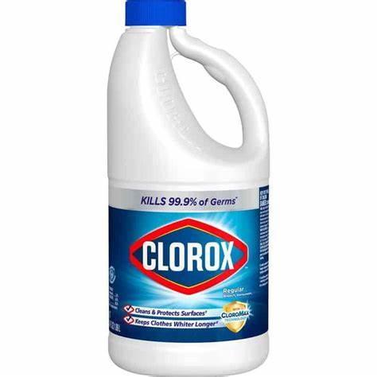
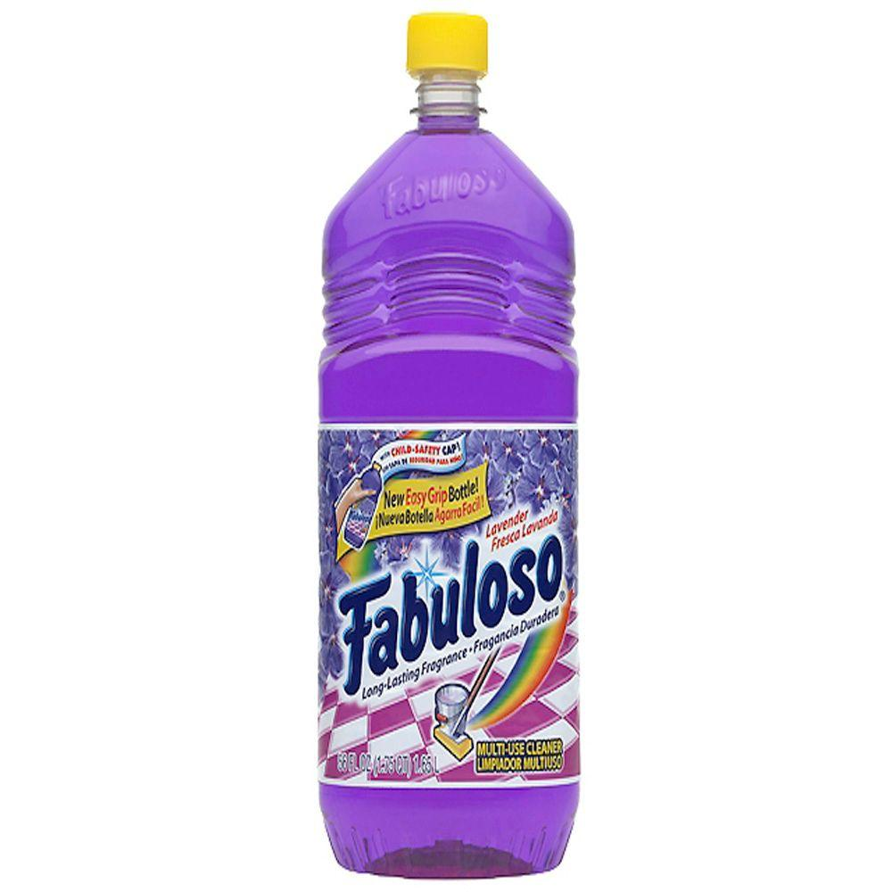
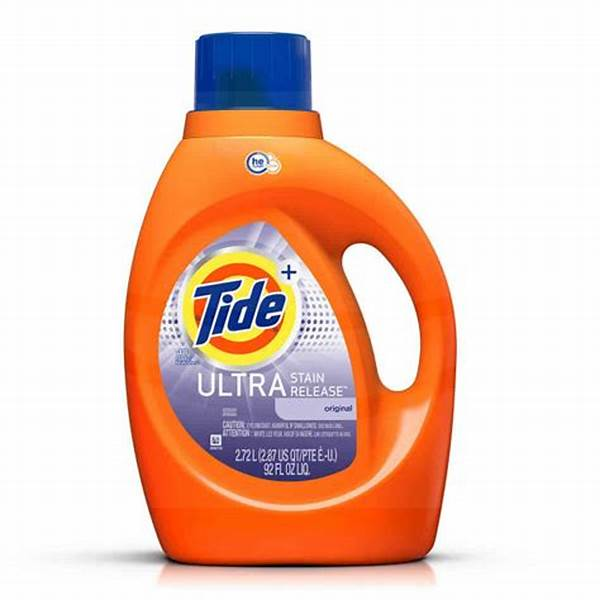
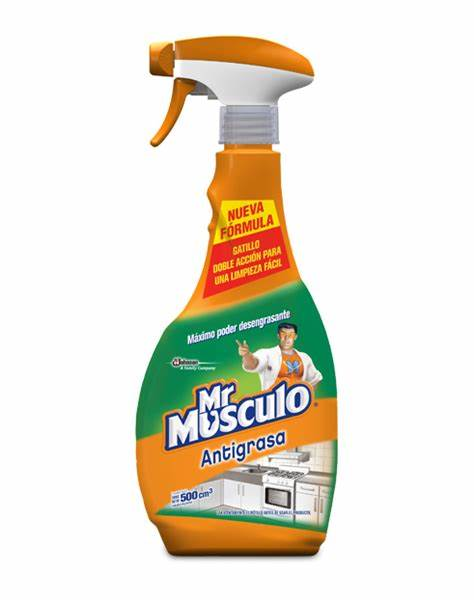
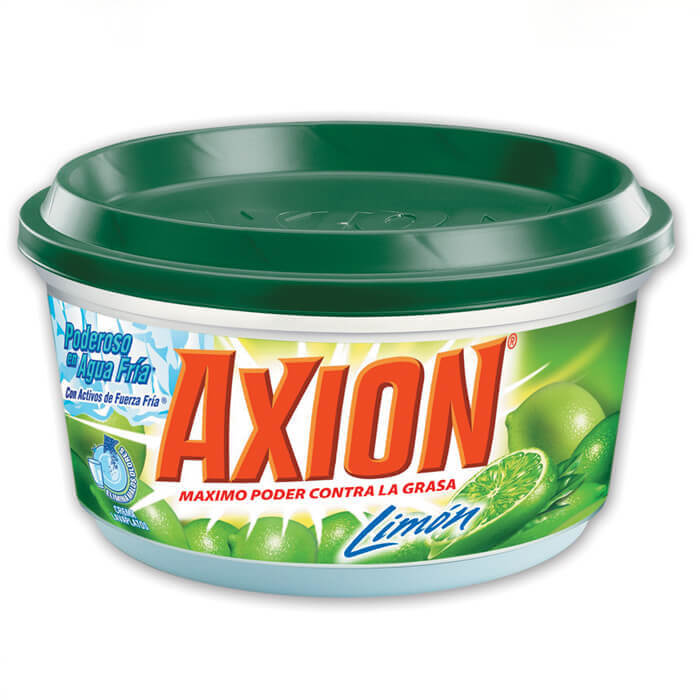
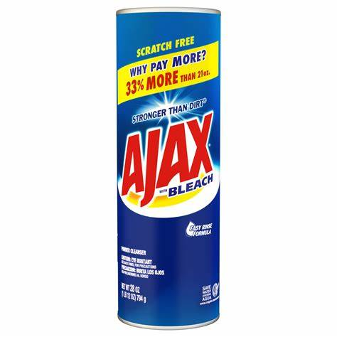

# Visor-de-Im-genes
<!DOCTYPE html PUBLIC "-//W3C//DTD XHTML 1.0 Transitional//EN"
"http://www.w3.org/TR/xhtml1/DTD/xhtml1-transitional.dtd"> 
<html>

<head>
  

</head>
<body>

<h1>Visor de imágenes</h1>

  
   
1. Cloro - Bleach.

   

</body>
</html>
